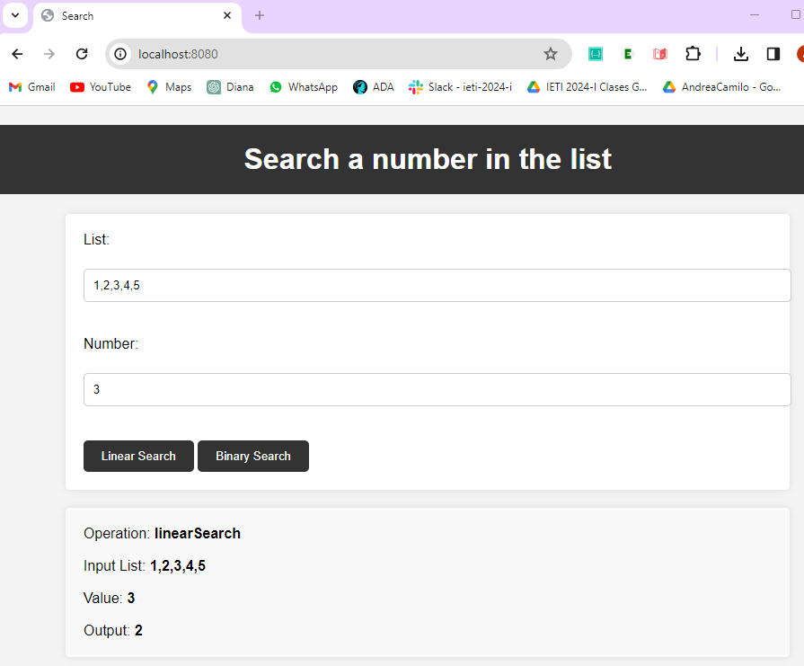
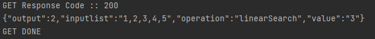
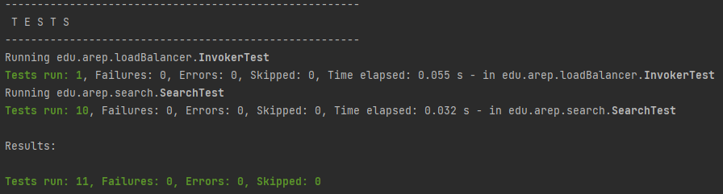
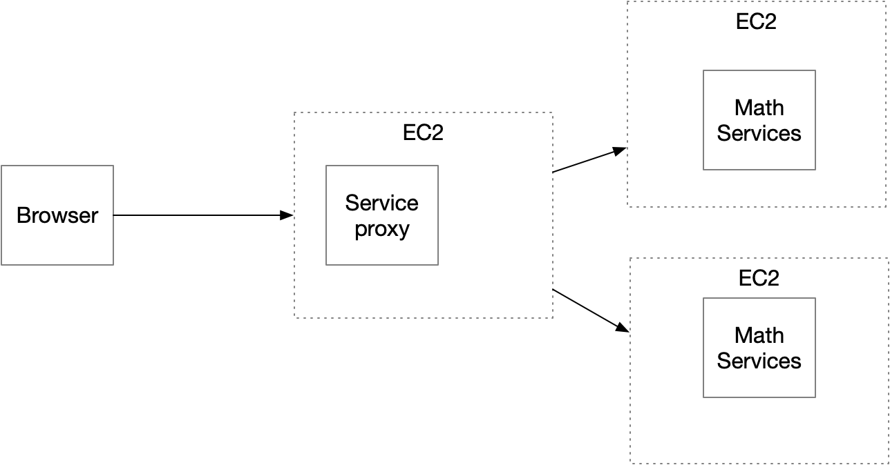

# AREP - Parcial 2

## Descripción

Este proyecto consiste en desarrollar una aplicación web que permite investigar dos algoritmos de búsqueda mediante un sistema de microservicios desplegado en tres máquinas virtuales de EC2 de AWS. La aplicación utiliza Maven para la gestión de dependencias, Git y GitHub para el control de versiones, y SparkJava para la implementación del servidor web. Además, se diseñó un servicio de proxy que utiliza un algoritmo de round-robin para distribuir las solicitudes entre dos instancias del servicio de ordenamiento. El cliente web, escrito en HTML y JS, permite a los usuarios invocar el servicio a través del proxy de manera asíncrona, proporcionando un formulario para cada una de las funciones de búsqueda. Este sistema demuestra la implementación de un sistema de microservicios escalable y distribuido, asegurando la disponibilidad y el rendimiento de las funciones de búsqueda.

## Comenzando

Las siguientes instrucciones le permitirán obtener una copia del proyecto en funcionamiento en su máquina local para fines de desarrollo y prueba.

### Requisitos

- [Git](https://www.youtube.com/watch?v=4xqVv2lTo40/) - Control de versiones
- [Maven](https://www.youtube.com/watch?v=1QfiyR_PWxU) - Gestor de dependencias
- [Java 17](https://www.youtube.com/watch?v=BG2OSaxWX4E) - Lenguaje de programación

### Instalación

#### Local
Para hacer una copia local del proyecto, debemos abrir nuestra terminal, dirigirnos al directorio donde estará el proyecto y usar el siguiente comando

```bash
git clone https://github.com/andreaduranvivas/AREP-Parcial2
```

Nos dirigimos al directorio creado con

```bash
cd AREP-Parcial2
```

Usando nuestro editor de código favorito, abrimos el proyecto y modificamos el archivo edu.arep.loadBalancer.Invoker.java,
y cambiamos la dirección IP de las máquinas virtuales de AWS por la dirección IP de nuestra máquina local (en la variable
MATH_SERVICE_URLS ponemos la dirección "http://localhost:8080").

#### Usando VM de EC2 de AWS

Una vez que tengamos nuestras instancias de EC2 en AWS, debemos conectarnos a ellas a través de SSH. Para ello, debemos tener la clave .pem que se nos proporcionó al crear la instancia.

Usando nuestro editor de código favorito, abrimos el proyecto y modificamos el archivo edu.arep.loadBalancer.Invoker.java,
y cambiamos las direcciones IP de las máquinas virtuales de AWS por las direcciones IP o el DNS público IPv4 de nuestras instancias de EC2

En este caso, una VM será para el servicio proxy y las otras dos (o más) serán para el servicio de ordenamiento. En cada una de las instancias, debemos instalar git, maven y java 17.
Una vez hecho esto, clonamos el repositorio en cada una de las instancias con el siguiente comando:

```bash
git clone https://github.com/andreaduranvivas/AREP-Parcial2
```

Y nos dirigimos al directorio creado con

```bash
cd AREP-Parcial2
```


## Ejecutando la aplicación

Para ejecutar la aplicación, primero debemos compilar el proyecto con el siguiente comando `mvn clean install`
. Esto nos permitirá limpiar las construcciones previas de otras versiones y luego compilará el proyecto.

#### Local

Abrimos una terminal y ejecutamos el siguiente comando:
```bash
  java -cp "target/classes/;target/dependency/*" edu.arep.search.MathService
```

Abrimos otra terminal y ejecutamos el siguiente comando:
```bash
  java -cp "target/classes/;target/dependency/*" edu.arep.loadBalancer.ProxyService
```

Para visualizar la aplicación, escogemos algún navegador e ingresamos la URL http://localhost:8080/ en la barra de direcciones. Allí encontraremos
el formulario donde se podrá ingresar la lista de números, el número a buscar y seleccionar el algoritmo de búsqueda deseado.
El siguiente es un ejemplo de cómo se vería la aplicación en el navegador.



Y en la consola del servicio proxy, podemos ver la comprobación de que se están realizando las peticiones a los servicios de ordenamiento.


#### Usando VM de EC2 de AWS

Una vez hemos compilado el proyecto en cada instancia, abrimos una terminal (de una vm, en este caso la del servicio proxy) y ejecutamos el siguiente comando:

```bash
  java -cp "target/classes/;target/dependency/*" edu.arep.loadBalancer.ProxyService
```

En las otras instancias, abrimos una terminal y ejecutamos el siguiente comando (estas servirán como servicios de ordenamiento):
```bash
  java -cp "target/classes/;target/dependency/*" edu.arep.search.MathService
```

A continuación se presenta un video demostrando el funcionamiento de la aplicación, haciendo uso de tres instancias de EC2 en AWS.
En este caso, lo único que cambiamos es la URL, ya que ya no sería localhost, sino el DNS de la IPv4 pública de nuestra VM.
Cabe recordar que se deben agregar las reglas de entrada a la instancia para poder ejecutar la aplicación, se deben abrir los puertos 4567 y 8080.

[](https://youtu.be/AINZ3AHpHRU)


## Pruebas

Las pruebas unitarias y de integración son fundamentales para asegurar la calidad del código y la correcta funcionalidad de las aplicaciones. En este proyecto, se han realizado pruebas tanto unitarias como de integración para los paquetes `edu.arep.loadBalancer` y `edu.arep.search`.
Las unitarias se pueden ejecutar al correr este comando`mvn test`

### Pruebas Unitarias

Las pruebas unitarias se centran en verificar el correcto funcionamiento de componentes individuales del código, como métodos o clases, en aislamiento. En este caso, se han realizado pruebas unitarias para los métodos de búsqueda lineal y binaria en el paquete `edu.arep.search`, así como para la rotación de URLs en el paquete `edu.arep.loadBalancer`.



#### Pruebas de Búsqueda

Las pruebas de búsqueda en `edu.arep.search` verifican la correcta funcionalidad de los métodos `linearSearch` y `binarySearch` bajo diferentes condiciones:

- **Búsqueda exitosa**: Verifica que el valor buscado se encuentra en la lista y que el índice devuelto es correcto.
- **Búsqueda fallida**: Verifica que el valor buscado no se encuentra en la lista y que el índice devuelto es -1.
- **Búsqueda en listas vacías**: Verifica que el comportamiento es el esperado cuando la lista de entrada está vacía.
- **Búsqueda en listas con un solo elemento**: Verifica que el comportamiento es el esperado cuando la lista de entrada tiene un solo elemento.
- **Búsqueda en listas con múltiples elementos**: Verifica que el comportamiento es el esperado cuando la lista de entrada tiene varios elementos.

#### Pruebas de Round Robin

Las pruebas de rotación de URL en `edu.arep.loadBalancer` verifican que la URL utilizada para la invocación cambia correctamente después de cada invocación, siguiendo el patrón de rotación round-robin. Esto se logra invocando el método `getMathServiceUrl` varias veces y verificando que `currentMathService` se ha reiniciado a 0 después de todas las invocaciones.

### Pruebas de Integración

Las pruebas de integración se enfocan en verificar que los componentes del sistema trabajen juntos correctamente. En este caso, las pruebas de integración podrían incluir la verificación de que las llamadas HTTP realizadas por el `Invoker` en `edu.arep.loadBalancer` se procesan correctamente y que los resultados de las búsquedas en `edu.arep.search` son los esperados.


## Documentación

Para visualizar la documentación del proyecto solo debes correr el siguiente comando desde el directorio raíz del proyecto

```bash
mvn javadoc:javadoc
```

Y en la siguiente ruta encontrarás el archivo index.html en donde si lo abres desde el navegador podrás ver toda la documentación

```
./target/site/apidocs
```

## Arquitectura de la aplicación

La arquitectura del prototipo consta de los siguientes componentes:

- **ProxyService:** Un servicio REST que recibe solicitudes de búsqueda de números y las distribuye entre dos instancias de MathService utilizando un algoritmo de round-robin. El servicio recibe una lista de números, un número a buscar y el algoritmo de búsqueda deseado, y devuelve el índice del número buscado en la lista.
- **MathService:** Dos instancias MathService, diseñadas para manejar las solicitudes de búsqueda de números y devolver el índice del número buscado en la lista. Se trata de un servicio REST que recibe una lista de números y un número a buscar, y devuelve el índice del número buscado en la lista.

A continuación se ve el diagrama de la arquitectura



## Autores

- **Andrea Durán** - [Usuario en GitHub](https://github.com/andreaduranvivas)

## Construido con

* [Spark Framework](https://sparkjava.com/) - Java/Kotlin web framework
* [Maven](https://maven.apache.org/) - Dependency Management
* [Java](https://www.java.com/es/) - Programming Language
* [JavaScript](https://developer.mozilla.org/en-US/docs/Web/javascript) - Programming Language
* [CSS](https://www.w3.org/Style/CSS/Overview.en.html) - stylesheet Language
* [HTML](https://html.com/) - HyperText Markup Language
* [Docker](https://www.docker.com/) - Containers Software

## Versiones


## Licencia

Este proyecto está bajo la licencia MIT. Ver el archivo [LICENSE](LICENSE) para más detalles.

## Agradecimientos

- Al profesor [Luis Daniel Benavides Navarro](https://ldbn.is.escuelaing.edu.co/)